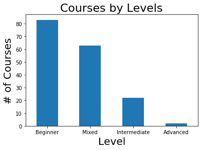
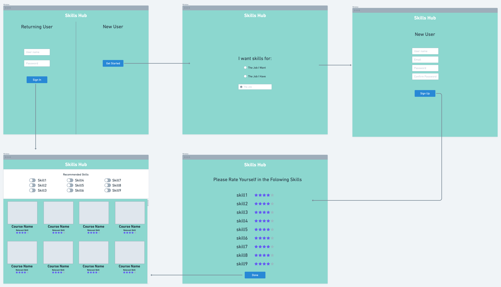

# Hackathon 4.25.2020 Education Track

> Authors: Alex Lau, Brandon Gottshall, Dimitri Plaskassovitis

## Table of Contents
- [Problem Statement](#Problem-Statement)
- [Executive Summary](#Executive-Summary)
- [Conclusion](#Conclusion)
- [Data Dictionary](#Data-Dictionary)

## Problem Statement
The current COVID-19 pandemic has caused huge disruption to health and economies around the world. Our federal and many of our local governments have mandated quarantine rules. Many people have lost their jobs, most likely their sole source of income. As many of us are staying home and practicing social distancing, this has also become an opportunity to take advantage of learning new skills whether it be for self improvement, or to become competitive in an increasingly digital world. We will attempt to pull data from 3 online course platforms (Coursera, Udemy, EdX) and consolidate to a single data frame to provide a convenient connected platform. Paid courses from these platforms are wonderful, with some sharable certificates, or even complete degrees, however, in the wake of massive unemployment, we will focus on the free ones in this project.

## Executive Summary
We begin our project by importing several Python packages for webscraping like BeautifulSoup, requests, and sleep for ethical scraping. We will also include popular packages like pandas for our data frames, matplotlib.pyplot for plots, numpy for computing. As we inspect each of our three online platforms, we nagivate to a page that lists all of the available courses. Some of these sites do not make it easy to find all free courses, so we will write code to search through the list and identify the free one. We will look for key features mentioned on our data dictionary at the bottom of this page. These features were included in the view for each observation of our web pages. We can use the F12 button in Google Chrome browser to display the HTML code, and sections of the page will be highlighed as we hover our mouse over the code. When we get to our desired section, we will notate the HTML tags and reference them in our code. After storing feature values for each observation into separate lists, we can combine them to build a data frame or table that stores all requested data. 

We were successful in pulling data fom Coursera, however, Udemy blocked our access perhaps recognizing our automation, and EdX did not seem to work with our code either. We will need to customize our methods for each of these. The duration of our effort was based on the Coursera platform, while still maintaing a single interface to multiple vendor mentality. Taking a conservative approach, we only identified free courses that had a yellow box with the word free next to the title. There are many courses that offered audit only for free, and the certificate at a cost. With more time, we can develop further solutions to capture these as well. After working through the caveats of tags that simply did not exist in some observations, we were able to get a relatively clean data frame of 170 free courses. A small portion of these are not in English, but may include subtitles.

(# of free Coursera courses by level)

During our Explatory Data Analysis, we found that half of the free courses offered by Cousera were at the beginner level, with each level decreasing in quantity of free courses. This is great news for the average person looking to learn a new skill or hobby. It also helps people decide whether they want to devote more time and effort to pursue a field without out of poket costs. With more time we would develop functions to iterate through and pull other features not included in the main view for a more complete list of features for a more robust tool. The next step of this project is to build an interface for people to use. See Brandon's design below:

(Skills Hub design)

## Conclusion
We find 170 free courses online on the Coursera platform in a variety of subjects to explore. While we were not able to scrape the Udemy data, you can find a list of 706 results that Udemy is offering for free in this link: https://www.udemy.com/courses/free/. EdX also offers free courses for audit without a certificate through this link: https://www.edx.org/course/?type=verified. For grade level or more standard curriculum, there are free classes on Khan Academy here: https://www.khanacademy.org/. There are plenty of resources for online learning, and now is a prime time to do it!

## Data Dictionary
|Feature|Type|Description|
|---|---|---|
|**title**|*object*|Name of the course| 
|**online_course_organization**|*object*|Platform the data is web scraped from| 
|**free**|*object*|Value to indicate this course is free, paid courses are removed from our view|
|**author_organization**|*object*|The partner organization for the course, be it a university, company, organization|
|**course_type**|*object*|Online classes can result in degrees, certificates, specializations or regular courses|
|**level**|*object*|Levels are ordinal values ranging from beginner, mixed, intermediate, and advanced|
|**ratings**|*float*|Average rating per course are between 0 for least favorable and 5 for most favorable|
|**reviews**|*integer*|Number of reviews per course|